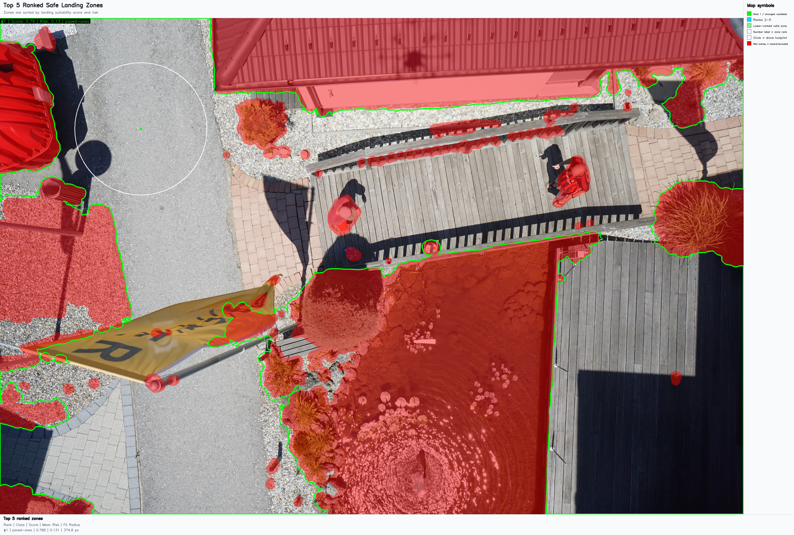
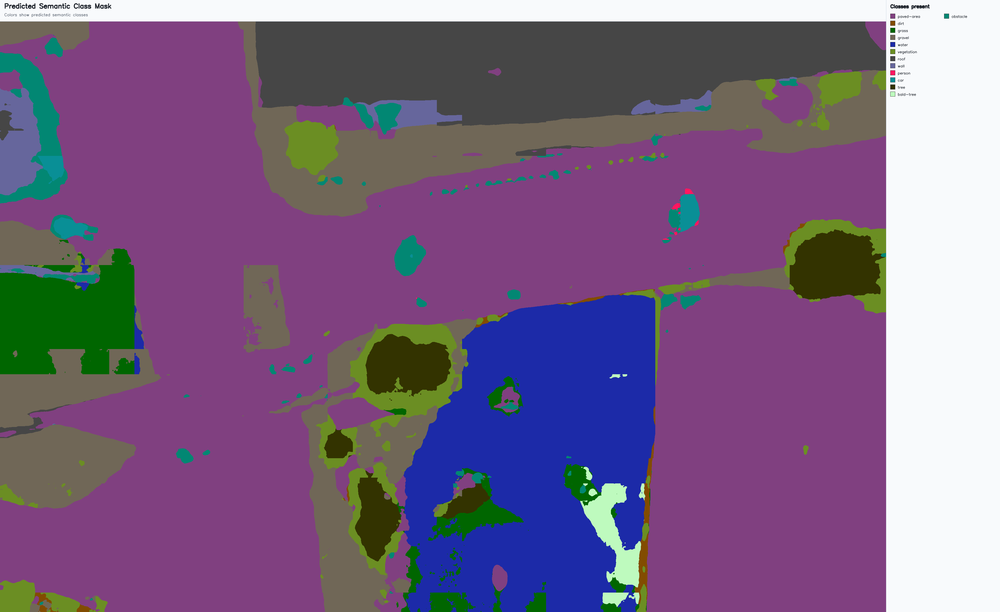
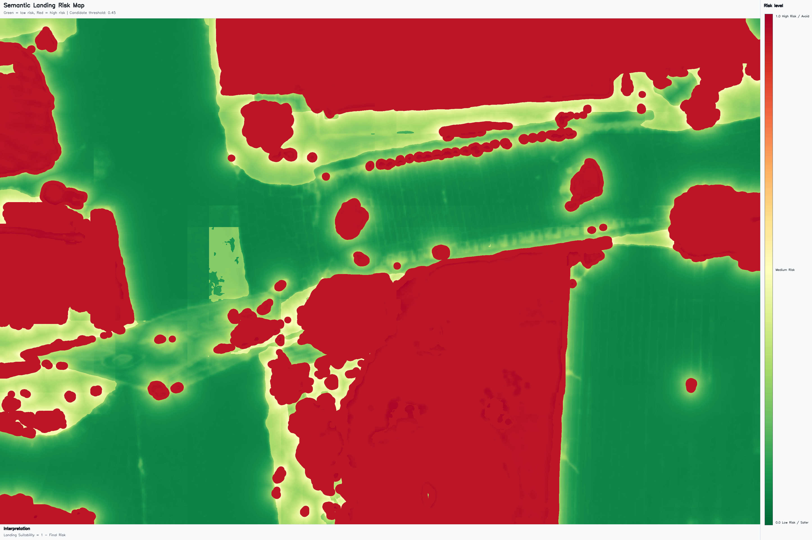
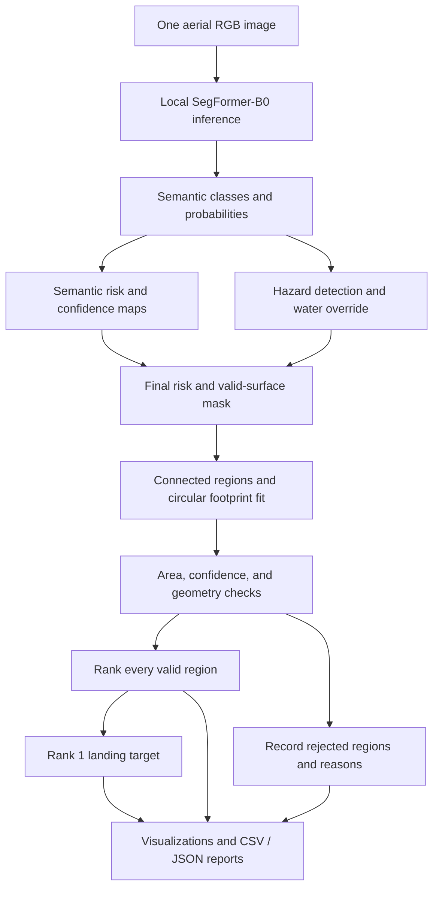

<div align="center">

# Safe Landing Zone Detection

### From aerial imagery to ranked, footprint-aware landing candidates.

A research demo that combines **SegFormer-B0 semantic segmentation**, **hazard-aware risk mapping**, and **circular footprint validation** to analyze a single aerial RGB image.


[Preview](#preview) · [Quick start](#quick-start) · [How it works](#how-it-works) · [Outputs](#outputs) · [Documentation](#documentation)

</div>

---

## Overview

Finding open ground is only part of selecting a landing location. A candidate also needs clearance from detected hazards, enough space for the drone footprint, and sufficient model confidence.

This project predicts **24 semantic classes**, builds a landing-risk map, and evaluates connected regions against those constraints. It ranks every valid region and exports the strongest candidate as an image-pixel target, alongside visual explanations and machine-readable reports.

> **Research scope:** “Safe” means that a region satisfies this demo's configured image-based criteria. RGB imagery cannot establish physical landing safety. This is not a certified autonomous-flight system, and exported targets are not GPS or UAV navigation coordinates.

## Preview

<p align="center">
  <a href="deliverables/research_packet/figures/top_safe_zones_labeled.png">
    
  </a>
  <br>
  <em>Actual saved result: red marks excluded hazards, green outlines the top-ranked region, and the white circle shows the requested footprint.</em>
</p>

| Semantic segmentation | Landing-risk map |
| :---: | :---: |
|  |  |
| What surfaces and objects does the model predict? | How suitable are those pixels under the configured rules? |

The illustrated run used `sample_images/525.jpg` and a **300 px footprint radius**, rather than the default 35 px. It produced one valid zone with center **(639, 502)** and maximum inscribed radius **374.8 px**. These are results from one saved example, not a model-accuracy benchmark. See the [example result summary](deliverables/research_packet/RESULT_SUMMARY.md) and [recorded settings](deliverables/research_packet/reports/run_metadata.json).

## Features

| Capability | What it provides |
| --- | --- |
| **Local model inference** | Loads the SegFormer-B0 checkpoint and processor from disk; uses CUDA when available, with CPU fallback. |
| **Tiled image processing** | Overlapping tiles preserve spatial detail when analyzing large aerial images. |
| **Hazard-aware filtering** | Combines predicted classes, car/danger probabilities, and expanded hazard boundaries. |
| **Footprint validation** | Finds centers where the requested circular footprint fits entirely within a valid region. |
| **Confidence-aware decisions** | Uses confidence and uncertainty maps to support risk scoring and region rejection. |
| **Complete zone ranking** | Exports every valid region with deterministic ranking and identifiers such as `Zone-01`. |
| **Water safety override** | Adds probability and RGB water cues without altering the raw semantic prediction. |
| **Explainable exports** | Saves labeled figures, plain images, ranked tables, rejection reasons, targets, and run metadata. |
| **Two interfaces** | Explore results in Streamlit or run repeatable analyses from the command line. |

## Quick start

### 1. Install dependencies

Use **Python 3.10 or newer** (recommended). From the project root:

```bash
python -m venv .venv
source .venv/bin/activate
python -m pip install -r requirements.txt
```

On Windows PowerShell, activate the environment with `.venv\Scripts\Activate.ps1` instead. If your interpreter is named `python3`, use that name when creating the environment. On Debian/Ubuntu, a missing `ensurepip` usually means the system `python3-venv` package must be installed.

The stack includes PyTorch, Transformers, NumPy, OpenCV, SciPy, Pillow, Matplotlib, pandas, and Streamlit. GPU execution requires a PyTorch installation compatible with your CUDA environment; CPU execution is supported.

### 2. Check the local model

Keep all five files together in the default runtime directory:

```text
model/
├── model.safetensors
├── config.json
├── preprocessor_config.json
├── label2id.json
└── id2label.json
```

The model and processor load with `local_files_only=True`. **Inference works offline once dependencies and model files are available.** Missing model files are not downloaded automatically. The CLI accepts an alternative directory through `--model_dir`.

### 3. Run the app

```bash
python -m streamlit run app.py
```

1. Open the local URL printed by Streamlit.
2. Upload one aerial JPEG or PNG image.
3. Adjust the risk threshold, minimum region area, and footprint radius as needed.
4. Click **Run analysis and save outputs**.
5. Review the ranked zones, best target, labeled gallery, and rejection report.

Each explicit analysis creates a new `outputs/Sample-XX/` folder. Ordinary interface reruns do not create extra sample folders. The **Show labeled visual outputs** control switches the gallery between presentation and plain images without repeating inference.

### Or use the CLI

Run a sample already present in this project:

```bash
python run_inference.py --image sample_images/525.jpg
```

For a run with debug maps and an explicit footprint:

```bash
python run_inference.py \
  --image sample_images/525.jpg \
  --model_dir model \
  --output_dir outputs \
  --tiled \
  --footprint_radius_px 35 \
  --save_debug
```

Use `python run_inference.py --help` for the complete argument reference. Large images can take substantial time and memory on CPU; `--no-tiled` selects single-pass inference when appropriate.

## How it works



### What makes a region valid?

A region must satisfy all six conditions:

1. Belong to an allowed semantic surface: **paved-area, grass, dirt, or gravel** by default.
2. Have candidate-pixel risk at or below the configured threshold.
3. Remain outside the dilated hazard mask.
4. Meet the minimum connected-region area.
5. Contain a center with enough clearance for the full circular drone footprint.
6. Meet the minimum mean model confidence, **0.50** by default.

A distance transform finds each region's maximum inscribed safe radius and its corresponding center. This helps reject long or narrow patches even when their total area is large.

Valid zones are sorted by **score descending**, then **mean risk ascending**, **maximum inscribed radius descending**, and **area descending**. Rank 1 is the single source for both the best-zone visualization and `landing_target.json`.

If no region qualifies, the app reports that outcome and still saves the analysis products. Rejection reports identify reasons such as `too_small`, `too_high_risk`, `hazard_overlap`, `footprint_does_not_fit`, and `low_confidence`.

<details>
<summary><strong>Risk model and ranking equations</strong></summary>

The base risk combines five factors:

```text
base_risk = 0.45  × semantic_risk
          + 0.25  × obstacle_proximity_risk
          + 0.15  × landing_area_size_risk
          + 0.075 × terrain_slope_proxy_risk
          + 0.075 × surface_roughness_proxy_risk
```

Obstacle proximity uses `exp(-distance / safe_distance_px)`. Area risk is `1 - min(area / desired_area, 1)`. **Slope and roughness are semantic-class lookup values, not measured terrain geometry.**

Confidence-aware risk is enabled by default. It blends normalized entropy into the existing risk and preserves the hard hazard floor:

```text
confidence_blended_risk = clip(0.85 × previous_risk + 0.15 × uncertainty, 0, 1)
landing_suitability = 1 - final_risk
```

Region ranking uses:

```text
region_score = 0.30 × mean_suitability
             + 0.25 × footprint_fit_score
             + 0.15 × obstacle_clearance_score
             + 0.10 × normalized_area_score
             + 0.10 × shape_quality_score
             + 0.10 × confidence_score
```

Shape quality considers compactness and bounding-box aspect ratio. Display categories are `Very Safe` (risk ≤ 0.25), `Safe` (≤ 0.40), `Moderate` (≤ 0.55), and `Risky` (> 0.55); these labels are demo categories, not aviation safety ratings.

</details>

## Configuration

The following are CLI defaults; the app exposes corresponding controls for interactive analysis.

| Setting | Default | Purpose |
| --- | --- | --- |
| `--risk_threshold` | `0.45` | Maximum candidate-pixel risk |
| `--min_area_px` | `1500` | Minimum connected-region area in pixels |
| `--desired_area_px` | `8000` | Area used to normalize the area-risk factor |
| `--footprint_radius_px` | `35` | Required circular footprint radius |
| `--safe_distance_px` | `40` | Distance scale for obstacle-proximity risk |
| `--hazard_dilation_px` | `15` | Expansion around detected hazards |
| `--hazard_override_risk` | `0.95` | Minimum risk assigned to effective hazards |
| `--car_prob_threshold` | `0.20` | Car-probability hazard trigger |
| `--danger_prob_threshold` | `0.35` | Summed danger-probability trigger |
| `--tile_size` / `--tile_overlap` | `512` / `96` | Tile dimensions and overlap in pixels |
| `--top_n_zones` | `5` | Number of zones in the top-zone visualization |
| `--max_zones_to_label` | `20` | Label limit for the all-zone visualization |
| `--max_zones_to_draw_footprint` | `10` | Footprint-circle limit |
| `--device` | `auto` | Device selection: `auto`, `cpu`, or `cuda` |

<details>
<summary><strong>Water override, optional scale, and display switches</strong></summary>

**Water override.** The default safety override combines argmax water predictions, water probability of at least `0.04`, and smooth, non-green blue/cyan or dark-neutral RGB cues on otherwise safe classes. RGB-only components smaller than `300 px` are removed. RGB-heuristic analysis is capped at a 1600-pixel maximum dimension to reduce memory pressure; its score is resized back to source resolution.

| Option | Default |
| --- | --- |
| `--use-water-override` / `--no-use-water-override` | Enabled |
| `--water-prob-threshold` | `0.04` |
| `--use-rgb-water-heuristic` / `--no-use-rgb-water-heuristic` | Enabled |
| `--water-rgb-threshold` | `0.40` |
| `--water-min-area-px` | `300` |

This is a temporary heuristic, not a retrained water detector. It can miss water or mistake shadows, blue roofs, and smooth dark surfaces for water. The raw semantic mask and model probabilities remain unchanged.

**Optional image scale.** Supply both values to derive the footprint radius from a known scale:

```bash
python run_inference.py \
  --image sample_images/525.jpg \
  --meters_per_pixel 0.05 \
  --footprint_diameter_m 1.2
```

```text
footprint_radius_px = (footprint_diameter_m / 2) / meters_per_pixel
```

Any exported `center_m` is a local image-plane offset from the image origin, not a georeferenced target.

**Other switches:**

- `--no-tiled`: disable overlapping tiled inference.
- `--no-use-confidence-risk`: disable uncertainty blending; region confidence checks remain separate.
- `--allow_ar_marker_as_safe`: explicitly allow the `ar-marker` class as a candidate surface.
- `--save_debug`: save diagnostic maps and class coverage.
- `--save_labeled`: explicitly request labeled visualizations (already enabled by default).
- `--no_labeled`: save plain visualizations only.

</details>

## Outputs

Each successful run gets the next available sample folder, preserving earlier results:

```text
outputs/
├── Sample-01/
│   ├── input_image.png
│   ├── semantic_mask.png
│   ├── overlay.png
│   ├── risk_map.png
│   ├── best_landing_zone.png
│   ├── all_safe_zones.png
│   ├── top_safe_zones.png
│   ├── water_detection_overlay.png
│   ├── ranked_safe_zones.csv
│   ├── ranked_safe_zones.json
│   ├── candidates.csv
│   ├── rejected_regions.csv
│   ├── landing_target.json
│   └── run_metadata.json
├── Sample-02/
└── …
```

The tree shows the main outputs. `original.png` is also retained for compatibility, and standard visualizations receive `_labeled.png` counterparts by default. Labeled images add titles, legends, colorbars, or explanatory panels outside the visualization.

| Artifact | Use it to… |
| --- | --- |
| `semantic_mask.png` / `overlay.png` | Inspect predicted classes with the model's exact class palette. |
| `risk_map.png` | Read low-to-high landing risk using a green-to-red scale. |
| `best_landing_zone.png` | Inspect the Rank-1 contour, center, and footprint. |
| `all_safe_zones.png` / `top_safe_zones.png` | Compare all valid regions or the configured top-N subset. |
| `water_detection_overlay.png` | Distinguish model, probability, and RGB water evidence. |
| `ranked_safe_zones.csv` / `.json` | Consume valid-only ranked regions and their geometry, risk, and confidence. |
| `candidates.csv` / `rejected_regions.csv` | Audit evaluated components and rejection reasons. |
| `landing_target.json` | Read the selected target, fit radius, class, score, and coordinate limitations. |
| `run_metadata.json` | Trace the input, model path, parameters, timestamp, and saved labeled outputs. |

With `--save_debug`, additional outputs cover car/danger probabilities, hazard overrides, before/after risk, class coverage, confidence, uncertainty, probability margin, footprint-valid centers, and water diagnostics. See the [complete artifact guide](docs/project_memory/OUTPUT_ARTIFACTS.md).

## Project structure

```text
.
├── app.py                  # Streamlit interface
├── run_inference.py        # CLI entry point
├── requirements.txt        # Python dependencies
├── src/
│   ├── model_loader.py     # Offline loading and label validation
│   ├── inference.py        # Full-image / tiled analysis pipeline
│   ├── risk_config.py      # Classes, palette, thresholds, and weights
│   ├── risk_map.py         # Risk, confidence, and hazard layers
│   ├── water_detection.py  # Temporary RGB water heuristic
│   ├── landing_zone.py     # Footprint fit, rejection, and ranking
│   ├── visualization.py    # Plain and labeled visualizations
│   ├── output.py           # Per-run folders and artifact exports
│   └── utils.py            # Image loading and shared utilities
├── model/                  # Runtime checkpoint and configuration
├── models/                 # Preserved original model files
├── sample_images/          # Aerial input examples
├── outputs/                # Generated runs; ignored by Git
├── deliverables/           # Research figures, reports, and drafts
├── docs/project_memory/    # Detailed technical and maintenance guides
└── VERSION.md              # Release history and verification records
```

## Limitations and research direction

Results depend on segmentation quality, representative training data, and threshold calibration. Probability-based overrides cannot reliably recover an object to which the model assigns almost zero probability. Confidence values are model outputs, not calibrated guarantees of safety.

This RGB-only pipeline does not measure physical slope, surface roughness, hidden obstacles, load-bearing capacity, wind, or UAV dynamics. Areas and distances remain image measurements unless reliable scale is supplied; there is no camera calibration or GPS output.

Planned directions include:

- [ ] Quantitative evaluation of zone ranking against labeled ground truth.
- [ ] Better water detection and threshold calibration.
- [ ] Depth or elevation input for physical terrain measurements.
- [ ] Camera calibration, georeferencing, and coordinate transforms.
- [ ] Separate ROS2 / Gazebo integration and validated UAV-planner targets.

These are future directions, not current capabilities. See the [development roadmap](docs/project_memory/TODO_NEXT_STEPS.md).

## Documentation

| Resource | Contents |
| --- | --- |
| [Release history](VERSION.md) | Version details, recorded checks, and known limitations |
| [Setup and commands](docs/project_memory/SETUP_AND_COMMANDS.md) | Additional setup guidance and troubleshooting |
| [Model and classes](docs/project_memory/MODEL_AND_DATASET.md) | Checkpoint contract, label vocabulary, and RGB palette |
| [Output reference](docs/project_memory/OUTPUT_ARTIFACTS.md) | Artifact meanings and generation conditions |
| [Research example](deliverables/research_packet/RESULT_SUMMARY.md) | Saved demonstration results and interpretation |
| [Code map](docs/project_memory/PROJECT_STRUCTURE.md) | Module responsibilities and repository layout |
| [Contributor starting point](CODEX_START_HERE.md) | Project context and maintenance workflow |

For changes to the pipeline, preserve the model's label order and palette, CPU fallback, and existing outputs. Include the input, settings, observed behavior, and relevant metadata when reporting an issue; exclude sensitive imagery.
